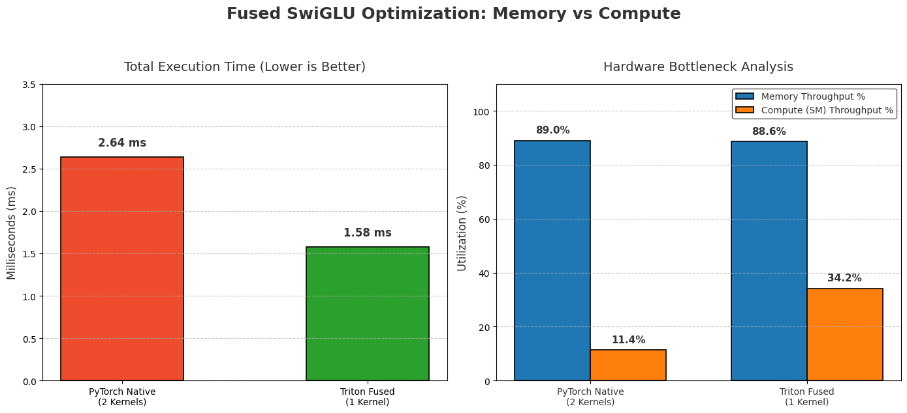

# Fused SwiGLU Activation Kernel

This folder contains a custom Triton kernel implementing a fused SwiGLU activation function, optimized for memory bandwidth and hardware utilization. 

SwiGLU is the standard activation function used in state-of-the-art LLMs like Llama 3 and Mistral. However, executing it natively in PyTorch introduces severe memory bottlenecks due to intermediate tensor materialization and kernel launch overhead.

## The Hardware Problem: Memory-Bound Execution

Mathematically, SwiGLU is defined as:
`SwiGLU(x) = SiLU(gate) ⊙ up`

When running this natively in PyTorch (`F.silu(gate) * up`), the framework executes multiple sequential kernels. Because element-wise operations are entirely **memory-bound**, the GPU's Compute (SM) cores sit idle while waiting for massive tensors to be fetched from High Bandwidth Memory (HBM).

### Architecture Comparison: PyTorch vs. Triton

By writing a custom Triton kernel, we bypass the intermediate HBM read/writes and perform the entire sequence of operations in the GPU's ultra-fast SRAM.

| Phase | PyTorch Native (2 Kernels) | Triton Fused (1 Kernel) |
| :--- | :--- | :--- |
| **Step 1** | Read `gate` from HBM to SRAM | Read `gate` & `up` blocks from HBM to SRAM |
| **Step 2** | Compute SiLU in SRAM | Compute SiLU natively in SRAM |
| **Step 3** | Write `temp_silu` to HBM ❌ *(Wasted Write)* | Compute Multiply (`gate` ⊙ `up`) in SRAM |
| **Step 4** | Read `temp_silu` & `up` from HBM ❌ *(Wasted Read)*| Write `result` block to HBM ✅ |
| **Step 5** | Compute Multiply in SRAM | - |
| **Step 6** | Write `result` to HBM | - |
| **Summary** | **3 HBM Reads, 2 HBM Writes** | **2 HBM Reads, 1 HBM Write** |

## Performance & Profiling (Nsight Compute)

To validate the hardware-level optimizations, this kernel was profiled using NVIDIA Nsight Compute (`ncu`) on an NVIDIA T4 GPU (Batch=8, Seq_Len=2048, Dim=4096).



By fusing the operations in SRAM, we effectively hid the SiLU computation behind the memory latency of loading the vectors. As shown in the chart above, shifting the workload off the memory bus and onto the compute cores resulted in massive efficiency gains.

| Metric | PyTorch Native | Triton Fused | Delta |
| :--- | :--- | :--- | :--- |
| **Execution Time** | 2.64 ms | **1.58 ms** | 🔥 **40% Speedup** |
| **Memory Throughput** | ~89.0% | ~88.6% | Maxed out in both |
| **Compute (SM) Util** | 11.4% | **34.2%** | 🚀 **3x Compute Efficiency** |

*Note: In the PyTorch baseline, the GPU SMs operated at only 11.4% capacity during the multiplication phase because they were bottlenecked waiting for the `temp_silu` and `up` tensors to arrive from HBM.*

## Usage

```python
import torch
from swiglu import triton_swiglu

# Initialize tensors
gate = torch.randn(8, 2048, 4096, device='cuda', dtype=torch.float16)
up = torch.randn(8, 2048, 4096, device='cuda', dtype=torch.float16)

# Run Fused Kernel
output = triton_swiglu(gate, up)